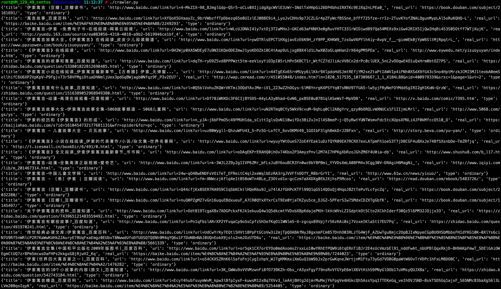

# BaiduCrawler
Baidu crawler, you can climb to search content, promote links

#### 使用方法：
环境：python >= 3.6.x  pip3工具
```
git clone https://github.com/xmapst/BaiduCrawler.git
cd BaiduCrawler
pip3 install -r requirements.txt
python3 crawler.py
```
#### 返回效果：
====返回各字段解析====：
```
# 返回一个字典
{'title': '标题', 'url': '百度快照URL/百度推广URL', 'real_url': '最终目标URL', 'type': '快照/推广 （ordinary/promotion）'}
```
==== 如图 ====：

